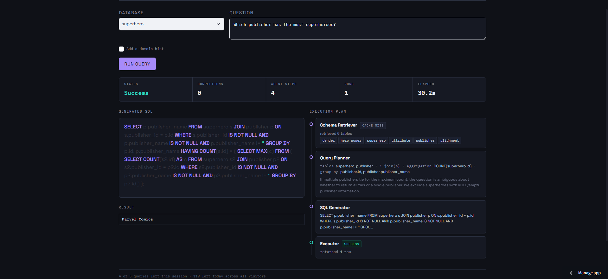
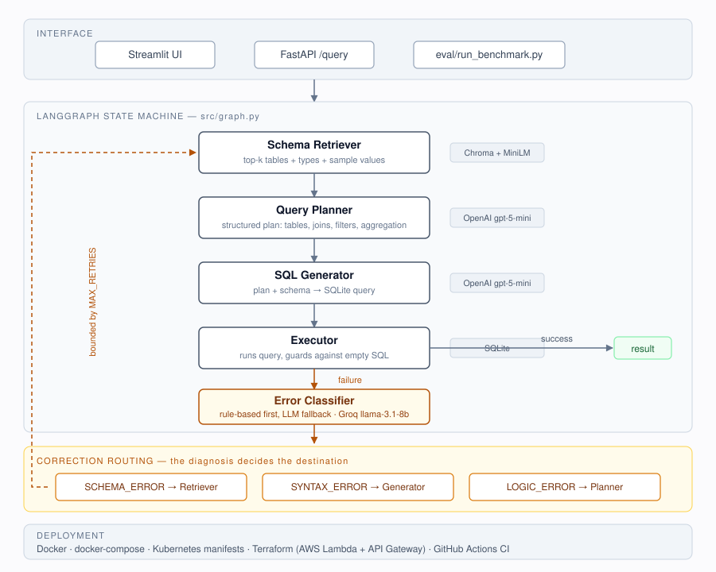

# Agentic NL2SQL — Self-Correcting Multi-Agent SQL Generation

> **Ask a database a question in plain English. Get correct SQL back.**
> Five specialised agents, a self-correcting loop that routes each failure to
> whichever agent caused it, and a measured **44.20%** on 500 BIRD-SQL questions
> — without the hints most published numbers use.




---

## Architecture



Five agents wired as a [LangGraph](https://github.com/langchain-ai/langgraph)
state machine with conditional edges (`src/graph.py`). The correction loop is the
part worth looking at: instead of re-prompting with a raw error, an
**error-classification router** diagnoses *why* the query failed and sends it back
to the agent responsible — a wrong table goes to the retriever, bad syntax to the
generator, faulty logic to the planner.

### Why five agents instead of one prompt

Each exists to solve a specific failure of the naive "dump-the-schema-and-ask"
approach:

- **Schemas don't fit usefully in a prompt.** 199 columns buries the relevant
  tables in noise. The retriever narrows to the top 6 by semantic similarity.
- **Planning and writing are different skills.** Emitting a structured plan before
  SQL is what makes targeted correction possible — you can fix a *plan*
  independently of fixing *syntax*.
- **Different failures need different fixes.** A wrong table reference and a
  malformed `GROUP BY` are not the same problem, and shouldn't get the same retry.

---

## Results

| Difficulty | Accuracy |
|---|---|
| simple | 61.49% (91/148) |
| moderate | 41.60% (104/250) |
| challenging | 25.49% (26/102) |
| **overall** | **44.20% (221/500)** |

Run without BIRD's `evidence` field — the human-written hints that often contain
the answer's formula. That makes this a *schema-only* result: the system must
work out what a question means from table and column structure alone. Published
numbers on this split generally include evidence, so they aren't directly
comparable.

### Per-database accuracy — and the finding that matters

| Database | Columns | Accuracy |
|---|---|---|
| superhero | 31 | 65.38% |
| european_football_2 | **199** | 56.86% |
| codebase_community | 71 | 55.10% |
| student_club | 48 | 54.17% |
| toxicology | 11 | 42.50% |
| formula_1 | 94 | 42.42% |
| card_games | 115 | 38.46% |
| debit_card_specializing | 21 | 36.67% |
| thrombosis_prediction | 64 | 34.00% |
| financial | 55 | 21.88% |
| california_schools | 89 | **16.67%** |

**Schema size does not predict accuracy — semantic clarity does.**
`european_football_2` has the largest schema in the benchmark (199 columns) and
scores near the top. `california_schools` has less than half that and scores
worst. The difference is whether column names carry meaning on their own:
`superhero.publisher_name` is self-describing, while answering a
`california_schools` question requires knowing that "total enrollment" means
`Enrollment (K-12)` + `Enrollment (Ages 5-17)` — information present in neither
the schema nor the column names.

This runs against the intuition that bigger schemas are harder. Retrieval handles
size well; it cannot manufacture domain knowledge that was never written down.

### Ablation: what BIRD's `evidence` field is actually worth

The claim above — that the ceiling is missing domain knowledge rather than
retrieval or reasoning — is testable. Turning `INCLUDE_EVIDENCE_IN_PROMPTS=true`
supplies exactly that missing knowledge and changes nothing else: same models,
same providers, same retrieval, same prompts otherwise.

Measured on the **first 150 questions** (not the full 500 — see the caveats
below), against the same 150 rows of the baseline:

| | Baseline (schema-only) | With `evidence` | Δ |
|---|---|---|---|
| simple | 62.50% (30/48) | 68.75% (33/48) | +3 |
| moderate | 40.58% (28/69) | 46.38% (32/69) | +4 |
| challenging | 24.24% (8/33) | **42.42% (14/33)** | +6 |
| **overall** | **44.00% (66/150)** | **52.67% (79/150)** | **+13** |

**+8.67 percentage points, and 17 fixed against 4 broken.** McNemar's exact test
on the 21 discordant pairs gives *p* = 0.0072, so unlike the prompt-rewrite
experiment recorded below, this one clears noise at this sample size. The largest
gain is on `challenging` questions, which nearly double — the questions where a
formula is most likely to be the thing standing in the way.

**What the hint actually supplies** is domain knowledge, in three recurring
forms — none of it inferable from schema:

- **A formula.** *"Average Monthly consumption = AVG(Consumption) / 12"* — the
  baseline wrote `AVG(Consumption)` and stopped, which is a defensible reading of
  the question and the wrong answer.
- **A value encoding.** *"Czech Republic ... is 'CZE'"*, or normal anti-centromere
  meaning `CENTROMEA IN ('-', '+-')`. The schema shows the column; nothing shows
  which literal means what.
- **Which column a phrase refers to.** *"date the dues was paid refers to
  `date_received` where `source = 'Dues'`"*.

This is the same category as the `california_schools` failure above, and the
ablation confirms the diagnosis: supply the missing knowledge and roughly a third
of the previously-failing questions in this slice resolve.

**Caveats, in order of how much they should temper the number:**

1. **n = 150, not 500.** The headline **44.20%** remains the schema-only figure
   over the full set and is the number to compare against published results. The
   150-question slice scores 44.00% on the baseline, close enough that it looks
   representative, but it covers only 4 of the 11 databases.
2. **`evidence` reaches the planner only.** `src/agents/query_planner.py` is its
   sole consumer; the generator sees the resulting plan, never the hint itself.
   A gain this size from a partial wiring suggests feeding it to the generator
   too would be worth measuring.
3. **One of the four regressions had no `evidence` at all** (`question_id` 1528,
   empty hint), so it is run-to-run nondeterminism rather than an effect of the
   change. The honest regression count attributable to evidence is 3, not 4.
4. **Sometimes the hint is simply wrong.** On `question_id` 1275 the evidence
   says `CENTROMEA IN ('-', '+-')` while BIRD's own gold SQL uses
   `IN ('negative', '0')`. Following the hint faithfully produces a wrong answer
   against the reference — a reminder that `evidence` is human-written annotation,
   not ground truth, and that some of the gap it closes is itself annotation
   artifact.

Reproduce with `python -m scripts.compare_ablation eval/results_500_baseline.csv
eval/results_150_with_evidence.csv 150`. Both arms' per-question rows are
committed.

---

## Why the schema index carries sample values

Column names alone caused a persistent, silent failure class. Two tables in
`debit_card_specializing` both have a `Date` column:

```
yearmonth.Date        (TEXT)  sample values: '201112', '201201', '201202'
transactions_1k.Date  (DATE)  sample values: '2012-08-24', '2012-08-23'
```

Without seeing actual values, the model reasonably assumed ISO dates and wrote
`strftime('%Y', Date) = '2012'` — which returns `NULL` against `'201208'` and
silently matches zero rows. No error, no exception, just a wrong answer. Indexing
real sample values alongside column names eliminated this category entirely.

---

## Stack

| Layer | Choice | Why |
|---|---|---|
| Orchestration | LangGraph | explicit state + conditional routing for the correction loop |
| LLM | Multi-provider (OpenAI / Groq / Gemini), selected per agent role | see below |
| Retrieval | Chroma + ONNX `all-MiniLM-L6-v2` | local embeddings, no API cost; the ONNX build rather than the PyTorch one, which cuts ~2GB of dependency and fits a 1GB container |
| Backend | FastAPI | exposes the graph as `POST /query` |
| Demo UI | Streamlit | generated SQL, results and the full agent trace, against the bundled BIRD databases **or your own SQLite upload** (50MB cap, session-scoped with automatic eviction, queried read-only) |
| Ops | Docker, docker-compose, GitHub Actions | containerised, CI-gated regression tests |

**Provider routing is per-role, not global.** The classifier picks one of four
category labels — a large reasoning model is waste there, so it runs on Groq's
`llama-3.1-8b-instant`. The planner and generator do the actual reasoning and run
on OpenAI's `gpt-5-mini`. Configured entirely through environment variables
(`src/config.py`), so switching a provider is a config change, not a code change.

That abstraction paid for itself: Gemini's free tier turned out to allow **20
requests per day** for `gemini-3.6-flash`, making it unusable for a 500-question
benchmark. Moving the planner to another provider took one line in `.env`.

---

## Setup

```bash
git clone https://github.com/v-arun2002/nl2sql-agentic-rag.git
cd nl2sql-agentic-rag
python -m venv venv && source venv/bin/activate   # Windows: venv\Scripts\Activate.ps1
pip install -r requirements.txt

cp .env.example .env
# add your API keys — see .env.example for which providers each role uses
```

Then fetch the dataset and build the schema index — see **`data/README.md`** for
the two-step process (questions from Hugging Face, `.sqlite` files from the BIRD
site), then:

```bash
python -m data.build_schema_index
```

## Running it

**Interactive demo** (two terminals):
```bash
uvicorn api.main:app --reload      # http://localhost:8000/docs
streamlit run ui/app.py            # http://localhost:8501
```

Or skip the backend entirely — `UI_DIRECT_MODE=true` invokes the graph in-process,
which is how the hosted demo runs on a single-process host:
```bash
UI_DIRECT_MODE=true streamlit run ui/app.py
```

### Querying your own database

The demo also accepts a SQLite upload, so it can be tried against real data
rather than only the bundled BIRD databases. On upload the file is validated,
its schema is introspected and embedded into its own Chroma collection, and it
joins the dropdown alongside the bundled ones.

Three constraints shape the implementation, and all three come from it being a
*public* demo on a ~1GB host:

**Everything is read-only.** Generated SQL is model output, and the target may be
a stranger's data, so `src/db/connection.py` opens every connection with both
`mode=ro` *and* `PRAGMA query_only`. Two mechanisms rather than one because they
cover different holes: `mode=ro` refuses writes to the main database and refuses
to create a missing file, while `query_only` also covers a database `ATTACH`ed
later in the same connection — `ATTACH` is itself a read, so `mode=ro` alone
permits it and a write through it would otherwise land. This applies to the
bundled databases too: a hallucinated `DROP` against a shipped BIRD file would
otherwise corrupt the demo for everyone until the next redeploy.

**Uploads are capped and evicted.** 50MB per file, three concurrent databases,
and a one-hour TTL. There is a visible Remove button, and eviction runs on every
registry read as the backstop — because most visitors will simply close the tab,
and without the automatic side uploads accumulate until the host is killed.
Removal frees the file, the Chroma collection, *and* the collection's segment
directory — see the `delete_collection` entry under notable bugs for why that
third one is not implied by the second.

**Validation happens before indexing, not at query time.** Extension, size, and
the `SQLite format 3` magic header are checked first, then the file is opened and
required to contain at least one table. A truncated or table-less upload is
rejected with a message and leaves nothing behind. Failing early matters here:
an empty or partial index doesn't error, it returns a partial schema that the
generator then fills in by invention — the silent-hallucination failure recorded
below.

The 50MB cap lives in `.streamlit/config.toml` as `maxUploadSize`, not only in
application code. Streamlit buffers the whole file before any handler sees it, so
rejecting an oversized upload in `src/uploads.py` happens after the memory has
already been spent — and the widget advertises the server's limit regardless of
what the app says, which is how it came to promise "200MB per file" beside a note
claiming 50MB.

**Upload embeddings are stored apart from the shipped index.** `chroma_db/` is a
committed build artifact — the deployed app cannot rebuild it, because not all the
BIRD `.sqlite` files ship — while upload segments are per-session garbage. They
initially shared one directory, which meant every visitor's upload dirtied a
tracked path and cleanup had to reason about two lifecycles in one place. Uploads
now write to their own Chroma store next to the uploaded files
(`UPLOAD_CHROMA_DIR`, defaulting inside the temp upload directory), so a database
and its embeddings are created and destroyed together and nothing ephemeral is
written inside the repository.

Uploads are session-scoped and stored in the OS temp directory, so they disappear
when the container restarts. They require the pipeline to share a filesystem with
the UI, which holds in `UI_DIRECT_MODE` (the deployed configuration) but not under
docker-compose, where the API runs in a separate container — the UI says so rather
than letting the query fail confusingly. Tunable via `UPLOAD_MAX_BYTES`,
`UPLOAD_MAX_CONCURRENT`, and `UPLOAD_TTL_SECONDS`; the existing demo query caps
still apply, since every query spends real API budget.

**Benchmark:**
```bash
python -m eval.run_benchmark               # full 500
BENCHMARK_LIMIT=50 python -m eval.run_benchmark   # quick slice
```
Results checkpoint to `eval/results.csv` every 10 questions, and a re-run resumes
from whatever is already there — a full run takes hours, and interruptions
shouldn't cost the whole thing.

**Regression tests:**
```bash
pytest tests/test_regression.py -v
```
Checks *correctness* (execution match against gold SQL), not merely that the
pipeline didn't crash.

**Containerised:**
```bash
docker compose up --build
```

---

## What this doesn't do

Honest limits, from the failure analysis in `eval/results.csv`:

**The correction loop cannot catch wrong-but-valid SQL.** On `california_schools`,
every failure had `retries: 0` — the SQL executed cleanly and returned rows, just
the wrong ones. There is no error to classify when a query succeeds with a
plausible wrong answer. Error-classification routing fixes *broken* SQL, not
*incorrect* SQL.

**Some questions are unanswerable schema-only by construction.** "Total enrollment
over 500" requires knowing it means the sum of two specific columns. That
information lives in BIRD's `evidence` field, which this configuration
deliberately withholds.

**Exact-match scoring penalises correct-but-differently-shaped answers.** Asked
for a "peak month," the system returned `'201307'` where the reference expects
`'07'`. Same logic, same underlying answer, scored wrong. A meaningful share of
the 279 failures are shape mismatches rather than reasoning errors.

### A negative result worth recording

Output-shape mismatches looked like the largest addressable failure category, so
the generator prompt was extended with explicit rules about column selection and
granularity. Measured on a fixed 50-question slice: **4 questions fixed, 2
broken, net +2 — within noise at that sample size.** Inspecting the regressions
showed the longer prompt had introduced *new* aggregation errors (`MAX(Consumption)`
where the previous prompt correctly summed per month first). The change was
reverted.

Reported here because a measured non-improvement is a result, and reverting on
evidence is the correct call.

---

## Notable bugs found and fixed

Each was diagnosed by isolating one layer and testing it directly, rather than
inferring from end-to-end output:

**Reasoning tokens consumed the entire output budget.** `max_completion_tokens=500`
on `gpt-5-mini` was fully spent on internal reasoning, returning `''` with no
error — the API call genuinely succeeded. Empty SQL then ran against SQLite as a
harmless no-op returning zero rows, which the pipeline recorded as *success*.
Three layers each behaved correctly in isolation while a silent failure passed
through all of them. Confirmed via `usage.reasoning_tokens=500` and
`finish_reason='length'`; fixed with a separate reasoning budget plus a guard
that treats empty SQL as an explicit failure.

**An empty vector index produced hallucinated schemas.** A rebuild command silently
never executed, leaving Chroma empty. Retrieval returned zero tables, which
became an empty schema string, which the planner accepted as valid context — so
the generator invented plausible tables (`gas_consumption`, `payments`) that
didn't exist. Accuracy sat at 5% for three runs. Found by testing retrieval in
isolation instead of trusting benchmark output.

**PyTorch didn't fit the deployment target.** The host allows roughly 1GB of
memory, and `sentence-transformers` pulls in PyTorch — well over that on its own.
Swapping to Chroma's ONNX build of the same `all-MiniLM-L6-v2` model dropped the
dependency to ~90MB on `onnxruntime`, which Chroma already requires. Verified
equivalent by rebuilding the index and confirming retrieval returned identical
tables and identical sample values.

**Gemini's free tier is 20 requests per day**, not per minute, for
`gemini-3.6-flash`. No amount of exponential backoff fixes a daily cap.

**`max_tokens` → `max_completion_tokens`** on newer OpenAI models. Handled with a
self-correcting fallback that tries the legacy parameter first and switches only
when a provider specifically objects, so Groq keeps working either way.

**Windows cp1252 encoding crashed the results write** *after* a completed run,
destroying several hours of output. Fixed with explicit UTF-8 plus
`errors="replace"`.

**No client timeouts.** A request that opened but never returned blocked a run
indefinitely — backoff only catches calls that *fail*, not ones that hang.

**A trailing space in user input crashed the pipeline three layers down.** Typing
`superhero ` in the UI produced the Chroma collection name `schema_superhero `,
which fails Chroma's name validation — surfacing as an error that pointed at the
vector store rather than at the input. Sanitised once at the state boundary,
where it covers every caller.

**The CI regression test was pinned to a database the repo doesn't ship**, so it
had failed on every push since the first commit. `.gitignore` commits 6 of BIRD's
11 databases; the test referenced `debit_card_specializing`, which isn't one of
them. It passed locally — where all 11 are present — and only ever failed in CI,
which is the reason it went unnoticed.

What made it genuinely hard to diagnose is that the committed Chroma index holds
collections for all 11 databases while only 6 have `.sqlite` files. So retrieval
*succeeded*, returned real tables, and the run proceeded normally until the
executor tried to open a file that wasn't there. The error surfaced three nodes
downstream of the actual cause and named the executor, pointing away from the
missing fixture entirely. Diagnosed by checking `git ls-files` against the
databases on disk rather than trusting a local test run. Now pinned to two
`superhero` cases that the 500-question baseline already answers correctly with
`retries: 0`, so a failure means a real regression rather than a borderline
question flipping.

**`mode=ro` alone did not make the database read-only.** Opening uploads with
`file:...?mode=ro` blocks writes to the main database, and it is easy to stop
there and call the problem solved. But `ATTACH` is itself a *read* — attaching a
second database is not a write to the first — so a read-only connection permits
it, and the attached database carries its own permissions. A generated
`ATTACH '...' AS w; INSERT INTO w.t ...` would therefore have executed. Found by
testing the escape rather than the flag: the `ATTACH` succeeded, which is the
correct behaviour and the reason the hole exists. `PRAGMA query_only` is what
closes it, because it refuses writes at the statement level across every database
on the connection. Both are now set in `src/db/connection.py`, and the test suite
asserts the attached-write case specifically, against the attached file's bytes.

The general lesson is the one this project keeps relearning: a security control
has to be tested by attempting the thing it forbids. Asserting that the connection
was *opened* with `mode=ro` would have passed while the hole was wide open.

**A global `font-family` rule broke every Material icon in the app.** The upload
button read `uploadupload`, and the expander had previously shown `_arrow_right`.
Streamlit's icons are *ligature* fonts: the element's text really is the word
`upload`, and the font turns it into a glyph. The app's own base rule —
`html, body, [class*="st-"], span, div { font-family: 'Space Grotesk', ... }` —
matches those icon spans, so the icon font was overridden and the ligature
rendered as its own name. Diagnosed by reading the computed style off the icon
span in a real browser, which reported `"Space Grotesk"`; the earlier assumption
that the icon font "wasn't loading" was wrong, and the expander was replaced with
a checkbox to work around a problem the stylesheet was causing. Re-asserting the
font on `[data-testid="stIconMaterial"]` after the base rule fixes every icon at
once — `document.fonts.check` goes from `false` to `true`, because the font was
never requested while the override was in force.

**Clicking Remove on an uploaded database brought it straight back.** Removal
deleted the file, the collection and the registry entry, and then the next rerun
re-registered the same database under a fresh `db_id`. `st.file_uploader` still
held the file, and clearing the de-duplication fingerprint made that file look
new. Only visible in a browser: the registry went from one entry to one entry, so
any assertion on the count passed, and the id had changed underneath. Fixed by
resetting the widget itself — its `key` carries a nonce that Remove increments —
so there is no file left to re-register. This is the one bug in the upload feature
that `streamlit.testing`'s `AppTest` could not have caught, since it cannot
populate a file uploader.

**Chroma's `delete_collection` doesn't free the disk it used.** It removes the
metadata rows, so the collection stops existing by every API the code can see —
`list_collections` no longer returns it — while its HNSW segment directory stays
on disk with `data_level0.bin` intact, ~170KB for a narrow schema and more for a
wide one. Found while verifying upload cleanup: the collection count went to
zero, and two orphaned UUID directories were sitting in `chroma_db/`,
unreferenced by the `segments` table. On the demo host that is a leak per upload
that no TTL reclaims, which is precisely the accumulation the eviction policy
exists to prevent. Fixed by reaping directories whose UUID is absent from
Chroma's own `segments` table.

Two things worth recording about the fix. The first attempt reported success it
hadn't achieved: `shutil.rmtree(..., ignore_errors=True)` swallows the
`PermissionError` raised while Chroma still holds the files mmap'd, so the
counter incremented for directories that were still there — the test caught it
by measuring the directory, not the return value. And the guard "no rows means a
bad read, so do nothing" was wrong in the one case that matters: deleting the
last collection empties `segments` legitimately, so the reaper skipped exactly
the cleanup it was written for. It now checks that the table *exists* instead of
inferring from emptiness.

**An empty `.dockerignore` sent the entire working tree to the Docker daemon.**
Build context was **3.81GB** — `venv/`, `.git/`, and the raw 320MB BIRD download
— producing a **6.85GB** image over a roughly **2 hour** build. Nothing was
broken, which is why it survived: every build succeeded, just slowly enough that
rebuilding was avoided, which in turn hid the four manifest bugs below behind an
image nobody wanted to rebuild. With the file populated: **17KB** of context, a
**3.22GB** image, and a **12 minute** build.

---

## Kubernetes

`k8s/` holds the full deployment — Namespace/ConfigMap/Secret split, Deployments
for API, UI and Redis, resource requests and limits, probes, and an HPA. It's
validated end-to-end on a local `kind` cluster: a real question routed through
the ingress returns correct SQL, and the HPA scales the API from 2 to 6 pods
under load. See `k8s/README.md` for the setup.

Manifests that have never been applied are not manifests that work. Applying
them surfaced six bugs, none of which are visible by reading the YAML — and the
last two only appeared under a real query, not a health check:

**A single `rewrite-target` can't serve two backends.** `nginx.ingress.kubernetes.io/rewrite-target: /`
rewrote `/api/health` to `/`, and the API only serves `/query` and `/health` —
so every API call through the ingress 404'd. The annotation is per-Ingress, not
per-path, so one Ingress cannot both strip `/api` for FastAPI and leave the root
untouched for Streamlit (which serves `/_stcore/*` off `/`). Split into two
Ingress objects.

**The liveness probe killed the pods it was meant to protect.** The app starts in
about a second, but `timeoutSeconds` defaults to `1`, and with several pods
unpacking a multi-GB image at once the probe timed out — so each pod was
restarted mid-startup. Fixed with a `startupProbe`, which gates liveness until
the container is actually up, rather than by guessing a larger
`initialDelaySeconds`.

**The HPA reported `cpu: <unknown>` and would never have scaled.** An HPA needs
metrics-server, which managed clusters ship and kind does not. Nothing in the
manifests is wrong — but "the YAML is correct" and "autoscaling works" are
different claims, and only applying it distinguishes them.

**The ConfigMap had drifted from `.env`.** It still pinned the planner to
`gemini-2.5-flash` from before the provider move described above. Google has
since retired that model for new users, so every query returned 500 while the
pods stayed green — the failure was in the request path, not the health path.
Config duplicated across two files diverges silently; the probes cannot catch it.

**A 512Mi memory limit OOM-killed the pod on the first real query.** Chroma, the
ONNX embedder and an in-flight query together exceed it, and the container died
with exit 137 mid-request. `/health` had passed continuously up to that point,
because serving a health check costs almost nothing. Raised to 1Gi, matching the
container size the embedder was chosen for.

**nginx returned 504 while the pod was working normally.** A multi-agent query
with a correction loop routinely outlives ingress-nginx's 60s default
`proxy-read-timeout`. The generated SQL was correct and the pod healthy — the
proxy simply stopped waiting. Raised to 300s.

Both of these are the same lesson as the reasoning-token bug above: a liveness
signal that costs nothing to serve tells you nothing about whether real work
succeeds.

## Repository layout

```
src/
  graph.py                 LangGraph state machine + correction routing
  config.py                per-role provider/model configuration
  llm_providers.py         multi-provider dispatch, backoff, timeouts
  agents/                  schema_retriever, query_planner, sql_generator,
                           error_classifier, shared state
  retrieval/               Chroma vector store + optional Redis cache
  db/executor.py           SQLite execution with empty-query guard
  db/connection.py         read-only connections (mode=ro + query_only)
  uploads.py               demo SQLite uploads: validation, TTL/cap eviction
  demo_limits.py           per-session and global daily query caps
eval/
  run_benchmark.py         benchmark harness (checkpointing + resume)
  metrics.py               execution accuracy (BIRD's EX metric)
  results_500_baseline.csv per-question results and failure taxonomy
  results_150_with_evidence.csv  evidence-ablation arm (see Results)
data/build_schema_index.py schema introspection + sample-value extraction
api/ ui/                   FastAPI backend, Streamlit frontend
k8s/ terraform/            Kubernetes manifests, AWS Lambda IaC
scripts/                   diagnostic tools used during development
```

## Extending

- `src/config.py` centralises model choice per role — swapping providers requires
  no code changes.
- `eval/results.csv` carries `error_classes_hit` per question; grouping by it
  gives the failure taxonomy directly.
- CI (`.github/workflows/eval.yml`) runs the small fixed regression set only, to
  stay fast. Run the full benchmark manually.
